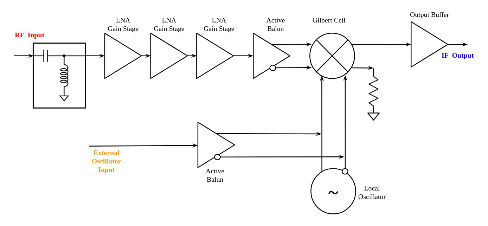
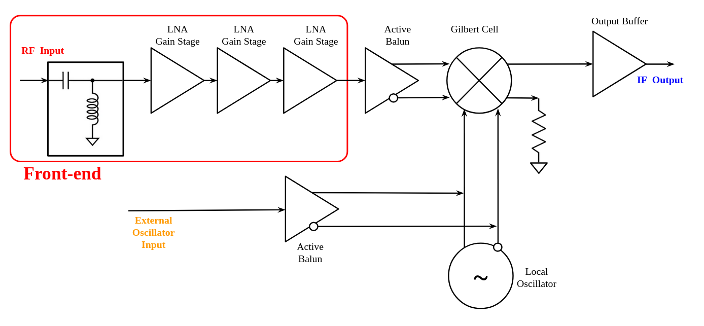
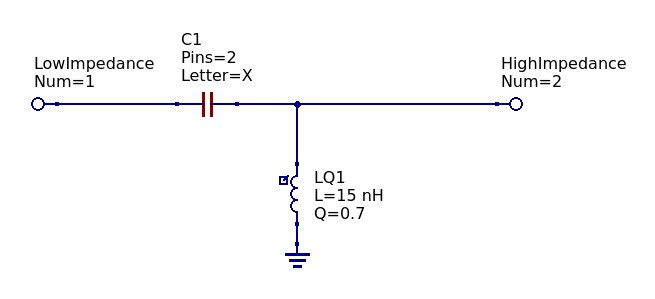
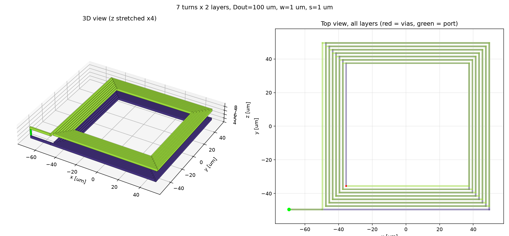
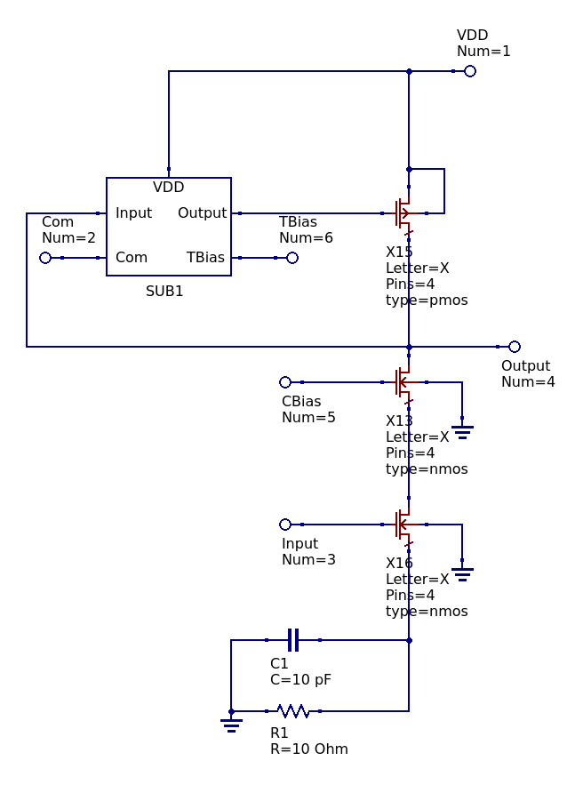
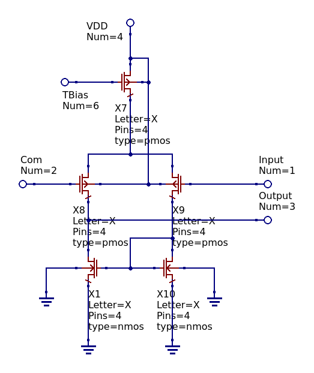
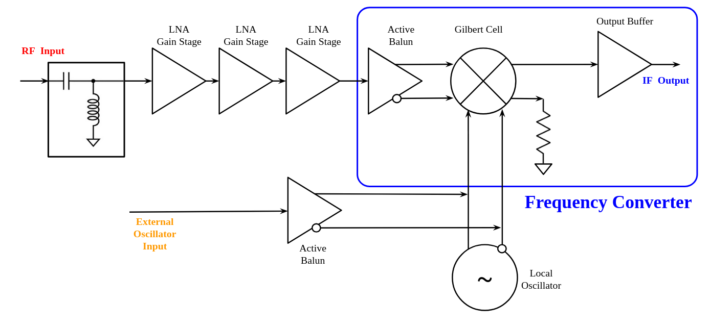

# Open Source 180nm BiCMOS L-Band LNB

This project is released under the MIT License. Copyright 2026 Charlie Sands & Lena Conde Araujo.

## Overview

This project intends to develop an integrated L-band block down converter including a low-noise amplifier, down converting mixer, and integrated local oscillator on the GF180MCU 180nm CMOS process node.  As a stepping stone towards this goal, we are targeting a tape-out of a noise amplifier through Wafer.Space on GF180MCU thanks to the Open Circuit Design Chipalooza Challenge.  This low-noise amplifier will validate many of the components which will be used on the down converter and allow for more detailed process characterization at microwave frequencies.

All components of the design target broadband operation between approximately 300 MHz and 2 GHz, will allow for down conversion of interesting signals in the UHF, L, and S band spectra. An integrated oscillator will provide a switchable L-band local oscillator signal to the mixer, allowing for standalone operation of the circuit as an integrated low-noise block (LNB) for applications such as reception of GOES weather satellite HRIT transmissions, GPS, and amateur radio (23 cm band).

Our goal is to develop this project using only open source tools, as such the tool chain used is:

- QUCS-S for schematic design and validation
- NGSpice for circuit simulation
- OpenEMS for full wave electromagnetic simulations
- KLayout for layout

The target performance submitted in the proposal for our project is included in the table below.

| Parameter                           | Minimum   | Typical   | Maximum |
| ----------------------------------- | --------- | --------- | ------- |
| Frequency Range                     | 900 MHz   | 1.7 GHz   | 2 GHz   |
| Power Gain                          | 10 dB     | 18 dB     | 27 dB   |
| Noise Figure                        | 2.2 dB    | 3 dB      | 7 dB    |
| Input Return Loss w/ Package (S11)  | -15 dB    | -20 dB    | -25 dB  |
| Output Return Loss w/ Package (S22) | -10 dB    | -15 dB    | -20 dB  |
| IIP3                                | -12.5 dBm | -11.5 dBm | -10 dBm |
| DC Power Consumption                | 15 mW     | 35 mW     | 130 mW  |
| Voltage Supply                      | —         | 5 V       | —       |
| Temperature Stability               | -25 °C    | —         | 125 °C  |

## Low Noise Block Down Converter

### Architecture

An overall block diagram of the proposed down converter is shown above.  The design of the system is separated into four major components: the front-end, the frequency converter, the local oscillator and supporting bias circuitry (not shown in the block diagram).  The front-end perform an impedance conversion from the 50Ω input impedance to a high characteristic impedance signal which then drives a series of three nMOS gain stages that follow. The frequency converter accepts a single ended, high impedance input signal from the front-end and a differential local oscillator.  It buffers out a 50Ω output signal that is approximately the linear multiplication of the two input signals.  This creates a lower frequency image of the RF input signal.  The integrated local oscillator provides a stable tone to the frequency converter.  It also allows for an external tone to be input into the device if higher stability is needed in a certain application.  The supporting bias circuitry biases the all of the components so that they operate correctly.

### Front-end

The front-end provides impedance conversion from the 50Ω circuit input impedance to the high impedance needed to drive the low-noise amplifier gain stages as well as a series of three gain stages which increase the signal voltage to a level necessary to drive the frequency converter.  This block is the main source of gain, as well as noise in the system.

#### Impedance Matching Network

*Most Up-To-Date Schematic: Schematic/Impedance Matching/ImpedanceMatchingMkII.sch*

Impedance conversion is performed in order to gain voltage headroom on the low-amplitude input signal, and bring it closer to the ~10kΩ input impedance of the nMOS gain stage gates ([gain stage input impedance]()).  The specified impedance matching network is designed to bring the 50Ω characteristic impedance input to approximately 500Ω to drive the succeeding gain stages.  The topology, seen in the figure above, was selected as L topology centered around 1.7GHz (the GOES HRIT frequency).  This simplicity of this matching network makes it possible to manufacture it on chip.  A 500Ω output impedance was selected in order to limit the size of the inductor in the matching network, making it possible to integrate the entire device onto the chip.  This also decrease the contribution of thermal noise on the layout terminating resistor.  The trade off of this decision is that the available voltage gain is also limited.

The inductor, simulated in OpenEMS, is a two layer spiral inductor (shown above) on the M4 and M5 metal layers ([OpenEMS results]()).

*Please note: this design is not final, more consideration will be needed in order to ensure that performance is as high as possible.  The matching network topology deliberately places this series inductor first in order to allow its inductance to combine with the series inductance of the bond wire leading to the pad ring.  Further packaging evaluation must be performed.*

[Network analysis of the matching performance](Simulation/Impedance Matching/Characterization.md) was performed.  Further simulation work, including Monte Carlo / variance analysis including the inductor and capacitor as well as (hopefully) layout-level full wave electromagnetic simulations will be done during the layout phase of the project.

It is projected that this impedance matching network would consume ~20,000 um2 of die space.  Given the large size of this network and the size constraints on the Chipalooza tape out, it is also possible to remove the matching network from the die and install externally using discrete components.  In addition to saving space, external matching would most likely allow for higher performance and better characterization of the active devices.

#### CMOS Gain Stage

*Most Up-To-Date Schematic: Schematic/Gain Stage/GainStageMkI.sch*

The CMOS gain stage increases the voltage level of the input signal.  A net power loss is incurred through the CMOS stages of the low noise block.  The power is "recovered" as the signal is buffered out by the output stage in the frequency converter.  The gain stage is a cascoded class A nMOS amplifier with active loading and an integrated common mode output controller.  Three identical gain stages are ganged together to provide the necessary voltage gain in the front-end.

*Most Up-To-Date Schematic: Schematic/Error Amplifier/ErrorAmplifierPMOSMkI.sch*

The common mode output control is achieved with a pMOS operational transconductance amplifier acting as an error amplifier on the output DC level.  Very small transistors are intentionally used on this component in order to limit the frequency response and load capacitance of the error amplifier.  Small transistors suffer from poor matching between identical devices fortunately [Monte Carlo simulations]() showed DC output level errors from mismatch in the control amplifier did not have a significant effect on system performance.  Increasing the size of the devices resulted in poor performance or oscillations in the output due to capacitive loading and coupling through the amplifier.

#### End-to-end Performance

Simulation was performed in QUCS-S and the following metrics were measured.  The following table includes a performance summary of the LNB front-end.  The variance reflected in these numbers are taken across the system performance corners and do not necessarily  reflect what the actual performance of the device will be.  It is expected that real performance will be much closer to the "typical" value.  Monte Carlo simulations of the system's performance was performed in order to 

| Parameter                    | Minimum | Typical | Maximum | Simulation Results          |
| ---------------------------- | ------- | ------- | ------- | --------------------------- |
| Voltage Gain                 |         |         |         | [Voltage gain test bench]() |
| Noise Figure                 |         |         |         | [Noise figure test bench]() |
| Input Return Loss (S11)      |         |         |         | [S-Parameter test bench]()  |
| Output Return Loss (S22)     |         |         |         | [S-Parameter test bench]()  |
| Reverse Isolation (S12)      |         |         |         | [S-Parameter test bench]()  |
| Forward Gain (S21)           |         |         |         | [S-Parameter test bench]()  |
| Voltage Gain Flatness        |         |         |         | [Voltage gain test bench]() |
| Output IP3                   |         |         |         | [Linearity test bench]()    |
| Input P1dB                   |         |         |         | [Compression test bench]()  |
| Rollett (K) Stability Factor |         |         |         | [S-Parameter test bench]()  |
| μ Stability Factor           |         |         |         | [S-Parameter test bench]()  |

  Monte Carlo simulations of the system S-parameters

### Frequency Converter

#### Active Balun

The active balun converts the amplified single ended signal from the front-end into a differential sign suitable for the differential gilbert cell mixer.  It is made up of a resistively loaded differential pair with automatic bias input level control.  Resistive loading suffers less gain and more noise than an actively loaded topology, but it was difficult to get the output level control using an active 

#### Gilbert Cell Mixer

#### Bipolar Output Buffer

#### End-to-end Performance

### Local Oscillator

#### Ring Oscillator

### Biasing

#### Reference

#### Reference

### Overall Performance

## Low Noise Amplifier

### Architecture

After initial design work and preliminary design review it was decided that the full down converter is potentially too ambitious for an initial tape out.  We have many questions regarding process performance at high frequencies, low performance in the frequency converter chain and concerns of electromagnetic coupling within the the chip, which would be very difficult to accurately simulate using open source tools, causing the circuit to oscillate.  In light of this, we are considering a pivot towards first taping out a dedicated low-noise amplifier covering a similar frequency band.  This design reuses the front-end module from the down converter, adding an additional gain stage in order to increase overall gain, and the output buffer.  The frequency converter is dropped and the dedicated pins normally allocated to the local oscillator will be re-used for devices useful for characterizing the die packaging.  This will allow for detailed characterization of the high frequency performance of the GF180MCU process node and put us on target to tape out the full down converter at a later time.

### Overall Performance

| Description              | Minimum | Typical | Maximum | Simulation Results               |
| ------------------------ | ------- | ------- | ------- | -------------------------------- |
| Frequency Range          |         |         |         | [S-Parameter Test Bench]()       |
| Power Gain               |         |         |         | [S-Parameter Test Bench]()       |
| Noise Figure             |         |         |         | [S-Parameter Test Bench]()       |
| Input Return Loss (S11)  |         |         |         | [S-Parameter Test Bench]()       |
| Output Return Loss (S22) |         |         |         | [S-Parameter Test Bench]()       |
| Output P1dB              |         |         |         | [Compression Test Bench]()       |
| Output IP3               |         |         |         | [Linearity Test Bench]()         |
| Output IP2               |         |         |         | [Linearity Test Bench]()         |
|                          |         |         |         |                                  |
| DC Power Consumption     |         |         |         | [Power Consumption Test Bench]() |
| Voltage Supply           |         |         |         | [Supply Sweep Test Bench]()      |
| Temperature Stability    |         |         |         | [Temperature Test Bench]()       |

## Acknowledgements

Preliminary design review performed by Prof. Brad Minch, Rohan Shah and Daniel Theunissen at Olin College of Engineering.   Thank you for all of your help!

Many thanks to Tim Edwards for design review and for running the Chipalooza tape-out program!
