# Open Source Inductorless 180nm BiCMOS L-Band LNA/LNB

This project is released under the MIT License. Copyright 2026 Charlie Sands & Lena Conde Araujo.

## Overview

This project intends to develop an integrated L-band block down converter including a low-noise amplifier, down converting mixer, and integrated local oscillator on the GF180MCU 180nm CMOS process node.  As a stepping stone towards this goal, we are targeting a tape-out of a noise amplifier through Wafer.Space on GF180MCU thanks to the Open Circuit Design Chipalooza Challenge.  This low-noise amplifier will validate many of the components which will be used on the down converter and allow for more detailed process characterization at microwave frequencies.

All components of the design target broadband operation between approximately 300 MHz and 2 GHz, will allow for down conversion of interesting signals in the UHF, L, and S band spectra. An integrated oscillator will provide a switchable L-band local oscillator signal to the mixer, allowing for standalone operation of the circuit as an integrated low-noise block (LNB) for applications such as reception of GOES weather satellite HRIT transmissions, GPS, and amateur radio (23 cm band).

Our goal is to develop this project using only open source tools, as such the tool chain used is:

- QUCS-S for schematic design and validation
- NGSpice for circuit simulation
- OpenEMS for full wave electromagnetic simulations
- KLayout for layout

The target performance submitted in the proposal for our project is included in the table below.

| Parameter                           | Minimum   | Typical   | Maximum |
| ----------------------------------- | --------- | --------- | ------- |
| Frequency Range                     | 900 MHz   | 1.7 GHz   | 2 GHz   |
| Power Gain                          | 10 dB     | 18 dB     | 27 dB   |
| Noise Figure                        | 2.2 dB    | 3 dB      | 7 dB    |
| Input Return Loss w/ Package (S11)  | -15 dB    | -20 dB    | -25 dB  |
| Output Return Loss w/ Package (S22) | -10 dB    | -15 dB    | -20 dB  |
| IIP3                                | -12.5 dBm | -11.5 dBm | -10 dBm |
| DC Power Consumption                | 15 mW     | 35 mW     | 130 mW  |
| Voltage Supply                      | —         | 5 V       | —       |
| Temperature Stability               | -25 °C    | —         | 125 °C  |

## Low Noise Block Down Converter

### Architecture

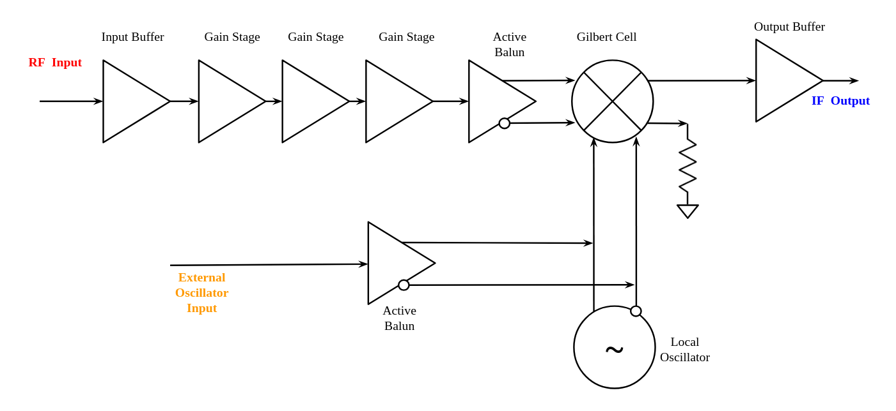

An overall block diagram of the proposed down converter is shown above.  The design of the system is separated into four major components: the front-end, the frequency converter, the local oscillator and supporting bias circuitry (not shown in the block diagram).  The front-end perform an impedance conversion from the 50Ω input impedance to a high characteristic impedance signal which then drives a series of three nMOS gain stages that follow. The frequency converter accepts a single ended, high impedance input signal from the front-end and a differential local oscillator.  It buffers out a 50Ω output signal that is approximately the linear multiplication of the two input signals.  This creates a lower frequency image of the RF input signal.  The integrated local oscillator provides a stable tone to the frequency converter.  It also allows for an external tone to be input into the device if higher stability is needed in a certain application.  The supporting bias circuitry biases the all of the components so that they operate correctly.

### Front-end

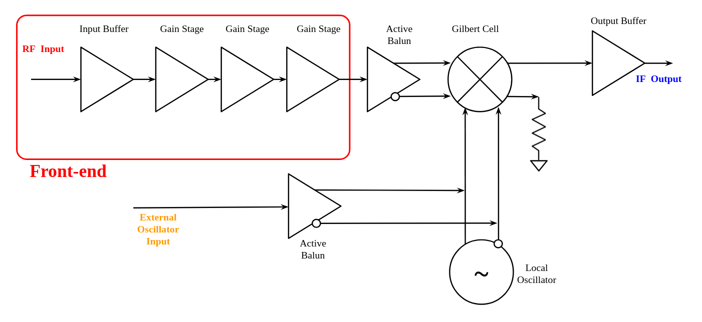

The front-end provides impedance conversion from the 50Ω circuit input impedance to the high impedance needed to drive the low-noise amplifier gain stages as well as a series of three gain stages which increase the signal voltage to a level necessary to drive the frequency converter.  This block is the main source of gain, as well as noise in the system.

#### Input Buffer

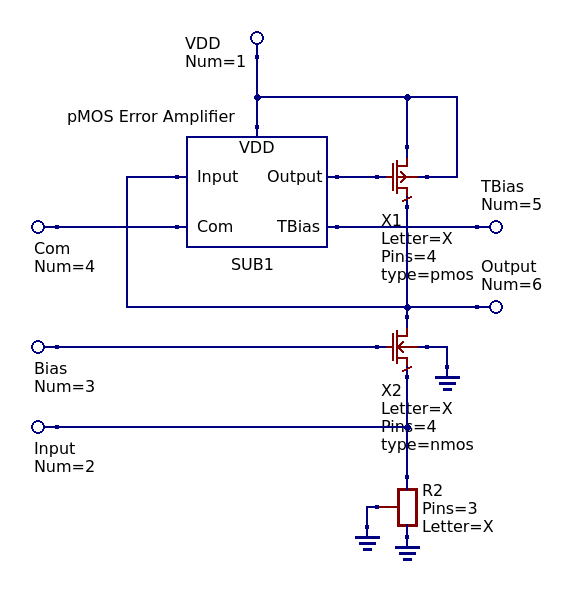

*Most Up-To-Date Schematic: Schematic/Input Buffer/InputBufferMkI.sch*

The input buffer is a common gate amplifier that provides a high quality impedance match between the source, and adds voltage gain to the system and the input of the LNA and performs an impedance conversion from the 50Ω input impedance of the circuit to the high impedance CMOS stages, where realizing voltage gain is easy.  The source loading resistor, in series with the input reactance of the common gate amplifier (proportional to 1/gm) is matched such that the input presents a nearly flat 50Ω impedance across the frequency band.  In reality, the match is fairly good.

#### CMOS Gain Stage

*Most Up-To-Date Schematic: Schematic/Gain Stage/GainStageMkII.sch*

The CMOS gain stage increases the voltage level of the input signal.  A net power loss is incurred through the CMOS stages of the low noise block.  The power is "recovered" as the signal is buffered out by the output stage in the frequency converter.  The gain stage is a cascoded class A nMOS amplifier with active loading and an integrated common mode output controller.  Three identical gain stages are ganged together to provide the necessary voltage gain in the front-end.  There is a degeneration resistor placed between the active load and the cascode stages in order to flatten gain and increase stability.  The amount of resistance can be adjusted to reach a desired performance.

#### Error Amplifier

*Most Up-To-Date Schematic: Schematic/Error Amplifier/ErrorAmplifierPMOSMkII.sch*

The common mode output control for both the gain stages and the input buffer is achieved with a pMOS operational transconductance amplifier acting as an error amplifier on the output DC level.  Very small transistors are intentionally used on this component in order to limit the frequency response and load capacitance of the error amplifier.  Small transistors suffer from poor matching between identical devices fortunately [Monte Carlo simulations]() showed DC output level errors from mismatch in the control amplifier did not have a significant effect on system performance.  Increasing the size of the devices resulted in poor performance or oscillations in the output due to capacitive loading and coupling through the amplifier.

#### End-to-end Performance

Simulation was performed in QUCS-S and the following metrics were measured.  The following table includes a performance summary of the LNB front-end.  The variance reflected in these numbers are taken across the system performance corners and do not necessarily  reflect what the actual performance of the device will be.  It is expected that real performance will be much closer to the "typical" value.  Monte Carlo simulations of the system's performance was performed in order to 

| Parameter                    | Minimum | Typical | Maximum | Simulation Results          |
| ---------------------------- | ------- | ------- | ------- | --------------------------- |
| Voltage Gain                 |         |         |         | [Voltage gain test bench]() |
| Noise Figure                 |         |         |         | [Noise figure test bench]() |
| Input Return Loss (S11)      |         |         |         | [S-Parameter test bench]()  |
| Output Return Loss (S22)     |         |         |         | [S-Parameter test bench]()  |
| Reverse Isolation (S12)      |         |         |         | [S-Parameter test bench]()  |
| Forward Gain (S21)           |         |         |         | [S-Parameter test bench]()  |
| Voltage Gain Flatness        |         |         |         | [Voltage gain test bench]() |
| Output IP3                   |         |         |         | [Linearity test bench]()    |
| Input P1dB                   |         |         |         | [Compression test bench]()  |
| Rollett (K) Stability Factor |         |         |         | [S-Parameter test bench]()  |
| μ Stability Factor           |         |         |         | [S-Parameter test bench]()  |

  Monte Carlo simulations of the system S-parameters

### Frequency Converter

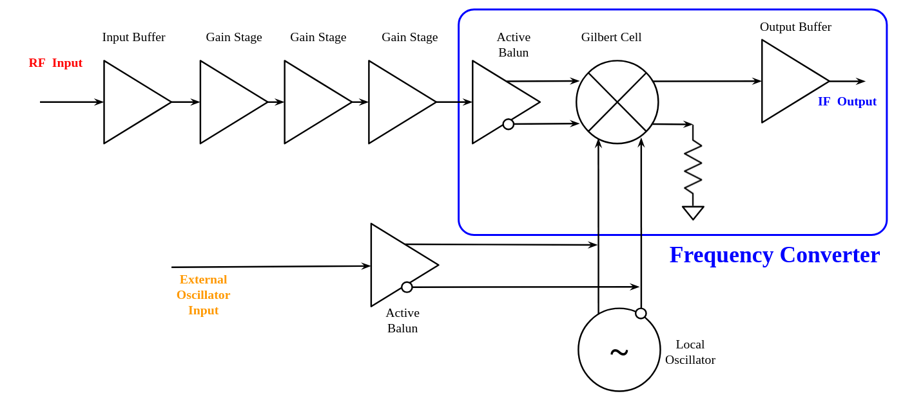

#### Active Balun

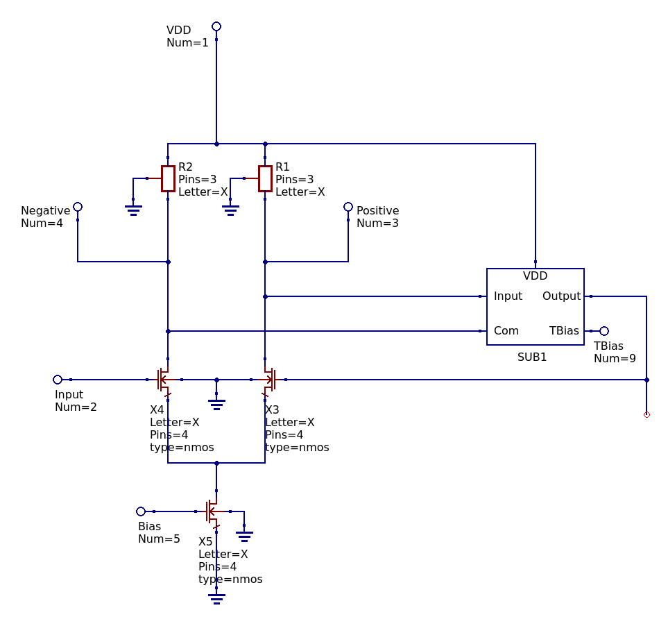

*Most Up-To-Date Schematic: Schematic/Balun/BalunMkIII.sch*

The active balun converts the amplified single ended signal from the front-end into a differential sign suitable for the differential Gilbert cell mixer.  It is made up of a resistively loaded differential pair with automatic bias input level control.  Resistive loading can realize less voltage gain and adds more noise than an actively loaded topology, but it was difficult to get the output level control using an active 

#### Gilbert Cell Mixer

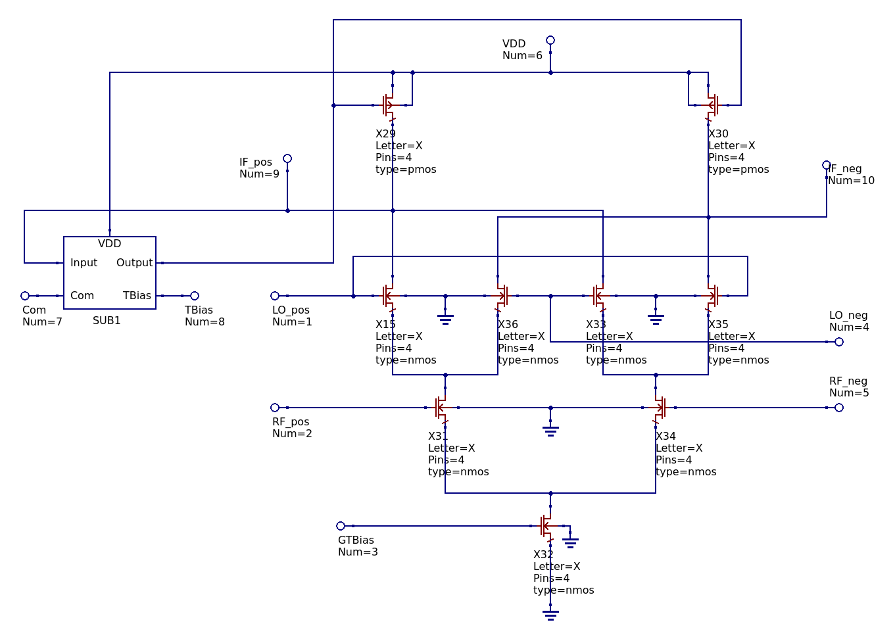

*Most Up-To-Date Schematic: Schematic/Mixer/MixerMkII.sch*

#### Bipolar Output Buffer

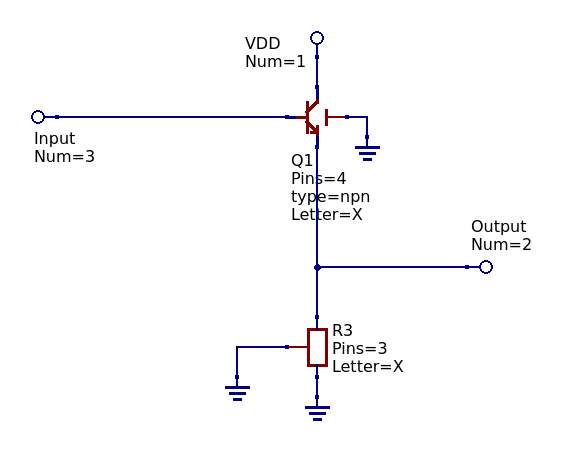

*Most Up-To-Date Schematic: Schematic/Output Buffer/OutputBufferMkVI.sch*

The lower output impedance of the NPN bipolar transistors included in the PDK makes it a good candidate to buffer out the amplified signal.  The buffer is a simple resistively loaded emitter follower stage, biased by the DC output of the CMOS stages.  Although the output is not efficient as it probably could be with more advanced topologies, this design is small, simple and does not risk adding feedback to the system that could cause oscillations.

#### End-to-end Performance

### Local Oscillator

#### Ring Oscillator

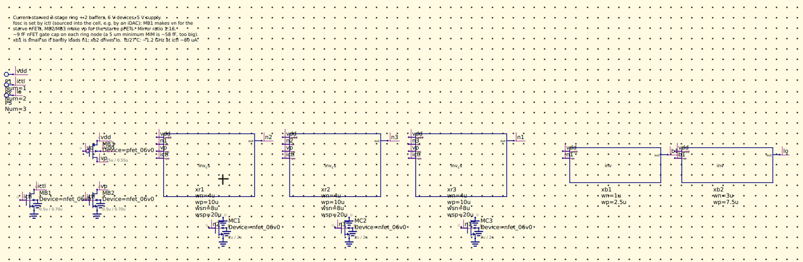

*Most Up-To-Date Schematic: Schematic/References/ringosci.sch*

The local oscillator is a three-stage current-starved inverter ring with a two-inverter output buffer, built from 6 V devices for a 5 V supply.  A control current into the `ictl` pin sets the frequency, so one of the harness iDACs can tune the LO after fabrication.  Pulling the control current stops the ring and parks the output at the supply, which is the disable for now.  There's no dedicated enable pin or external LO input yet.

| Parameter                               | Minimum  | Typical  | Maximum  |
| --------------------------------------- | -------- | -------- | -------- |
| LO Frequency, 20 µA Control Current     | 0.45 GHz | 0.48 GHz | 0.50 GHz |
| LO Frequency, 80 µA Control Current     | 1.02 GHz | 1.22 GHz | 1.36 GHz |
| LO Frequency, 200 µA Control Current    | 1.13 GHz | 1.42 GHz | 1.67 GHz |
| Supply Current, Running at 80 µA        | 1.31 mA  | 1.57 mA  | 1.82 mA  |
| Supply Current, Control Current Removed | 13 µA    | 35 µA    | 58 µA    |

Minimum and maximum are across the process corners at 5 V and 27 °C.  The tuning curve flattens out above about 100 µA, and the oscillator is free running, so the frequency also moves with temperature (1.36 GHz at -25 °C down to 1.01 GHz at 125 °C at 80 µA) and supply.  The full results are [here](Schematic/References/Characterization.md#ring-oscillator).

### Biasing

Biasing for the various circuit elements is provided by two similar, extremely bare-bones, LDOs making use of the harness band gap reference.  

#### Reference

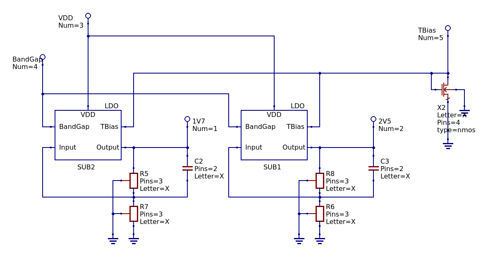

*Most Up-To-Date Schematic: Schematic/LDO/ReferenceMkI.sch*

Two LDO circuit with output voltages set by a high-res poly resistor divider are used to create a 1.7V and 2.5V bias reference on the chip.  The LDOs rely on the band gap voltage reference on the harness in order to generate the correct voltage.  Within the LNB there are some places where the band gap reference is directly used for biasing.  If this is unacceptable due to harnessing constraints, an additional stage buffer stage can be added. In the LNB stages the 1.7 V rail generally serves as the reference for the common mode output controllers and the 2.5 V rail serves as a bias point for the cascoded nMOS transistors in the gain stages.  In the Gilbert cell the 1.2 V from the band gap reference is also used.

Testing and characterization of the voltage reference is available [here](Schematic/LDO/Characterization.md).

#### Self-Biased Reference

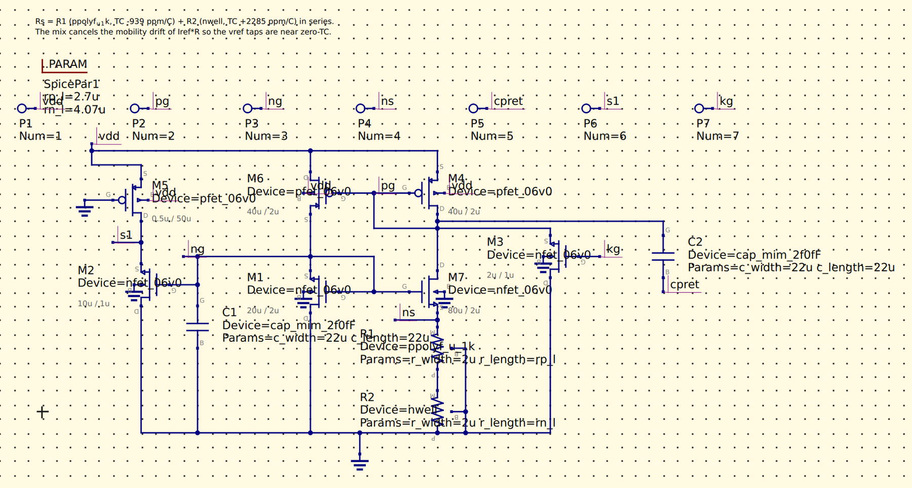

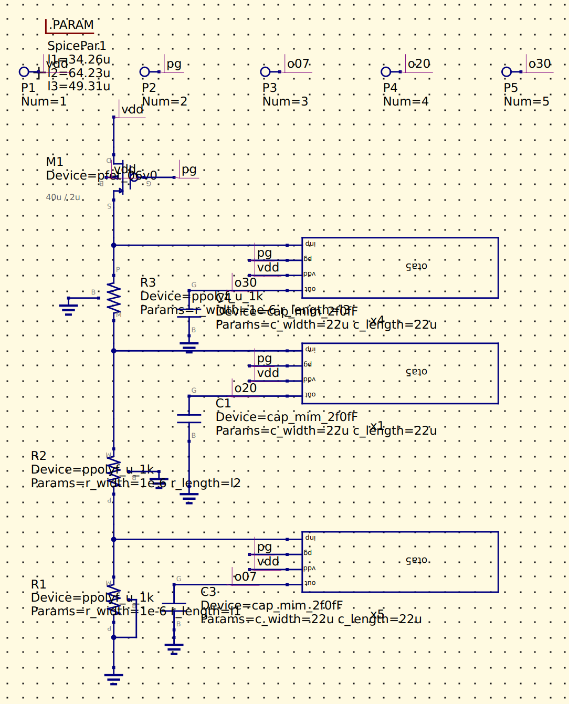

*Most Up-To-Date Schematics: Schematic/References/beta_mult.sch, Schematic/References/vref.sch*

A second bias generator that doesn't need the harness band gap: a beta-multiplier current reference feeds a tapped poly resistor string, and a five-transistor OTA buffers each tap.  It gives 0.7 V, 2.0 V and 3.0 V from a 5 V supply using 6 V devices.

| Parameter                    | Minimum | Typical | Maximum |
| ---------------------------- | ------- | ------- | ------- |
| 2.0 V Tap                    | 1.91 V  | 2.00 V  | 2.11 V  |
| Line Regulation              | 7.2 %/V | 7.8 %/V | 8.5 %/V |
| Change Over -25 °C to 125 °C | 6.5 %   | 6.9 %   | 7.5 %   |
| PSRR at 1 kHz (2.0 V Tap)    | 15.6 dB | 16.7 dB | 17.5 dB |
| Mismatch, 1σ (2.0 V Tap)     | --      | 51 mV   | --      |
| Supply Current               | 97 µA   | 119 µA  | 156 µA  |

Minimum and maximum are across the process corners at 5 V and 27 °C.  It starts up reliably and is stable into capacitive loads, but since it's self-biased the outputs wander with supply, temperature and mismatch much more than the LDOs above.  So the LNA doesn't use it; the LDO reference is still the bias source.  The full results are [here](Schematic/References/Characterization.md).

#### LDO

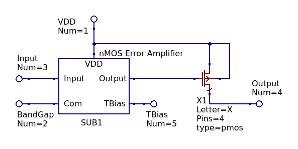

*Most Up-To-Date Schematic: Schematic/LDO/LDOMkI.sch*

A simple LDO for biasing was created by adding an output buffer transistor to a five transistor differential amplifier.  The arbitrary output voltage is divided and compared to a reference level.  The reference level in this design is provided by the harness band gap reference.  This basic LDO topology has limited accuracy, but the bias points of these transistors does not need to be extremely accurate.  

#### nMOS Error Amplifier

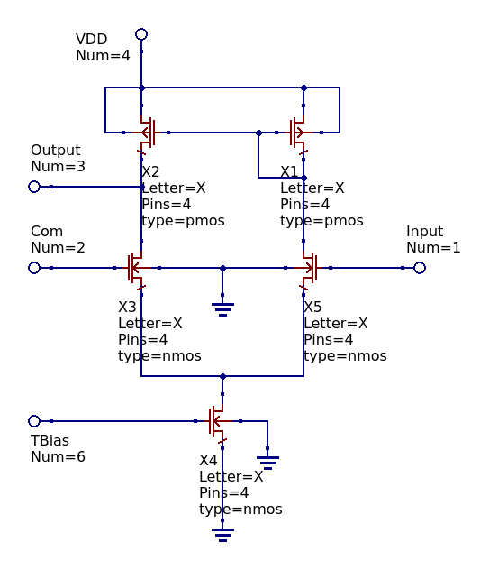

The output control for the reference LDOs is provided by the above nMOS error amplifier.  The transistors of the nMOS error amplifier are much larger than those of the pMOS error amplifier because matching is of greater concern than gain or frequency response.

### Overall Performance

Prior to the preliminary design review, this design was characterized at the typical corners, as well as the slow and fast corners.  Performance is mostly hindered by lots of LO feed through due to poor local oscillator quality.  The addition of the mixer and oscillator raise many questions about the stability of the design, especially with unaccounted for electromagnetic coupling in effect.

## Low Noise Amplifier

*Most Up-To-Date Schematic: Schematic/LNA/LNAMkII.sch*

### Architecture

After initial design work and preliminary design review it was decided that the full down converter may be too ambitious for an initial tape out.  We have many questions regarding process performance at high frequencies and, more importantly, concerns of electromagnetic coupling within the the chi, which would be very difficult to accurately simulate using open source tools.  If these are not accounted for there is a real risk that the entire circuit will begin to oscillate.  In light of this, we are considering a pivot towards first taping out a dedicated low-noise amplifier covering a similar frequency band.  This design reuses the front-end module from the down converter, adding an additional gain stage in order to increase overall gain, and the output buffer.  The frequency converter is dropped and the dedicated pins normally allocated to the local oscillator will be re-used for devices useful for characterizing the die packaging.  This will allow for detailed characterization of the high frequency performance of the GF180MCU process node and put us on target to tape out the full down converter at a later time.

The diagram above shows the working principle of the LNA with biasing removed.

Testing and characterization of the voltage reference is available [here](Schematic/LNA/Characterization.md).

### Overall Performance

A summary of the proposed LNA's performance is below.  More details regarding the simulations used to determine these performance metrics are linked in the table.  The variability within this table spans all corner simulations the PDK supports, that is, this much variability would not be likely on a single die, although one extreme or the other could theoretically be reached on a single die.

| Description              | Minimum | Typical | Maximum | Simulation Results                                                                                |
| ------------------------ | ------- | ------- | ------- | ------------------------------------------------------------------------------------------------- |
| Frequency Range          | 300 MHz | 1.7 GHz | 2 GHz   | [S-Parameter Test Bench](Schematic/LNA/Characterization.md#s-parameter-test-bench)                |
| Power Gain               | 9 dB    | 13 dB   | 21 dB   | [S-Parameter Test Bench](Schematic/LNA/Characterization.md#s-parameter-test-bench)                |
| Noise Figure             | --      | --      | --      | [S-Parameter Test Bench](Schematic/LNA/Characterization.md#s-parameter-test-bench)                |
| Input Return Loss (S11)  | -13 dB  | -15 dB  | -17 dB  | [S-Parameter Test Bench](Schematic/LNA/Characterization.md#s-parameter-test-bench)                |
| Output Return Loss (S22) | -5 dB   | -7 dB   | -9 dB   | [S-Parameter Test Bench](Schematic/LNA/Characterization.md#s-parameter-test-bench)                |
| Rollett Stability Factor | > 1400  | --      | --      | [S-Parameter Test Bench](Schematic/LNA/Characterization.md#s-parameter-test-bench)                |
| Output P1dB              | -19 dB  | -17 dB  | -16 dB  | [Compression Test Bench](Schematic/LNA/Characterization.md#compression-test-bench)                |
| Output IP3               | -9 dBm  | -7 dBm  | -7 dBm  | [Linearity Test Bench](Schematic/LNA/Characterization.md#s-parameter-test-bench)                  |
| Gain Flatness            | 6 dB    | 8 dB    | 11 dB   | [S-Parameter Test Bench](Schematic/LNA/Characterization.md#linearity-test-bench)                  |
| DC Power Consumption     | --      | 50 mW   | --      | [Power Consumption Test Bench](Schematic/LNA/Characterization.md#dc-power-consumption-test-bench) |
| Voltage Supply           | 3.0 V   | 3.3 V   | 3.3 V   | [Supply Sweep Test Bench](Schematic/LNA/Characterization.md#supply-sweep-test-bench)              |
| Temperature Stability    | -25 C   | --      | 125 C   | [Temperature Test Bench](Schematic/LNA/Characterization.md#temperature-test-bench)                |

The weakest point of the amplifier performance is the output compression; it compresses at a very low output power level.  This is alright for satellite communication and weak amateur radio communications, where the signals are already very weak to begin with and the LNA is used after an antenna to amplify a signal before it reaches the high gain, but higher noise figure front-end amplifiers of a software-defined radio. That being said, it would limit use of the component in other applications (such as a diode-ring mixer pre-driver).  The limit is likely a result of cascode drain degeneration on the middle two common source gain stages.  The trade off is kept because this degeneration flattens the frequency response of the amplifier and will make it more stable.  Amplifier stability is of chief concern, it is better to have a low amplifier that works than an oscillator.

The top-level schematic of the entire LNA is shown above.  

## Acknowledgements

Preliminary design review performed by Prof. Brad Minch, Rohan Shah and Daniel Theunissen at Olin College of Engineering.   Thank you for all of your help!

Many thanks to Tim Edwards for design review and for running the Chipalooza tape-out program!
